```{r Pacotes, echo=FALSE, message=FALSE, warning=FALSE}
library(knitr)
library(htmltools)
library(rmarkdown)
```
<br>
Portfolio para empresas e universidades.
<br>
```{r, echo=FALSE, out.width='100%', fig.align='center', message=FALSE, warning=FALSE}
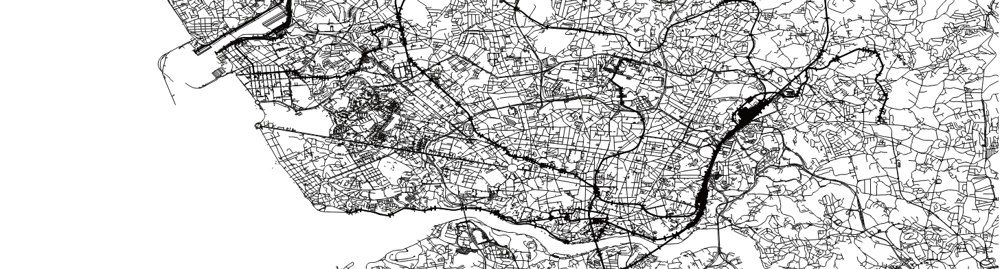
```

# Sobre mim


<div style="display: flex;">

<div>
<br>
Sou um apaixonado pela natureza. Os mecanismos, as formas e as cores encantam-me.
Por isso escolhí a Engenharia Florestal como curso e profissão. Aliado a isso, tenho um fascínio por tecnologia e pelas inúmeras possibilidades de soluções que ela pode trazer para o setor ambiental.
<br>
<br>
Sou graduado em **Engenharia Florestal** pela **Universidade de Brasília - UnB**, na qual, tenho muito orgulho de ter feito parte por conta da história e das pessoas que fazem parte dela. Concluí o curso em julho de 2023.
<br>

</div>

<div>

```{r, echo=FALSE, out.width='60%', fig.align='center', message=FALSE, warning=FALSE}

```


</div>

</div>

<div style="display: flex;">
<div>
<br>
```{r, echo=FALSE, out.width='70%', fig.align='center', message=FALSE, warning=FALSE}
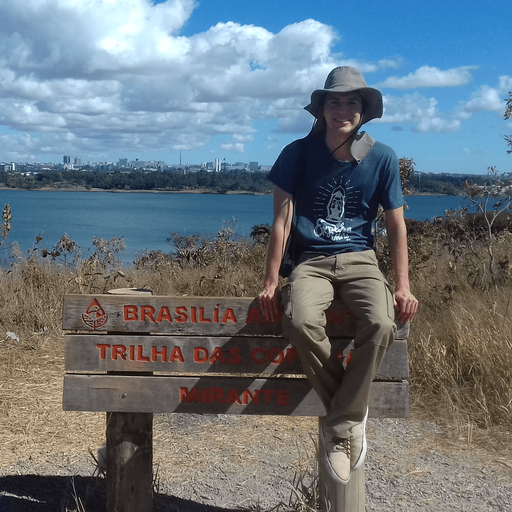
```

</div>

<div>
<br>
<br>
Durante minha graduação, participei de atividades extra curriculares em áreas bem diversas com o intuito de experimentar os mais diferentes campos de conhecimento. Entre as atividades está um estágio, projetos de iniciação científica, cursos e um intercâmbio.
<br>
<br>
Desta forma, este portifolio tem como objetivo apresentar alguns projetos desenvolvidos durante a minha graduação e contar algumas experiências.
<br>

</div>
</div>
```{r, echo=FALSE, out.width='100%', fig.align='center', message=FALSE, warning=FALSE}
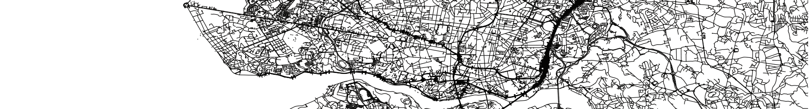
```

# Projetos de pesquisa

Desde que ingressei na universidade, sempre tive muito interesse em projetos de pesquisa. Sempre vi como uma oportunidade de aprender mais profundamente alguns temas.
<br>
Pelo Programa de Iniciação Científica (PROIC) da UnB tive a oportunidade de trabalhar em quatro projetos:
<br>

<div style="display: flex;">

<div
<br>
```{r, echo=FALSE, out.width='50%', fig.align='center', message=FALSE, warning=FALSE, fig.cap="Monte da Capela no Parque Estadual dos Pirineus"}
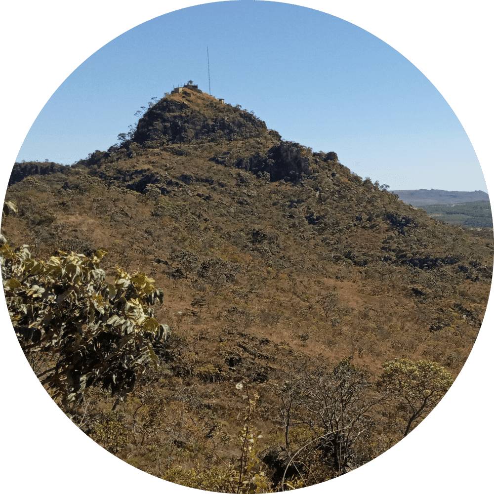
```
<br>
```{r, echo=FALSE, out.width='50%', fig.align='center', message=FALSE, warning=FALSE, fig.cap="Captura de coordenada geográfica na ESECAE"}
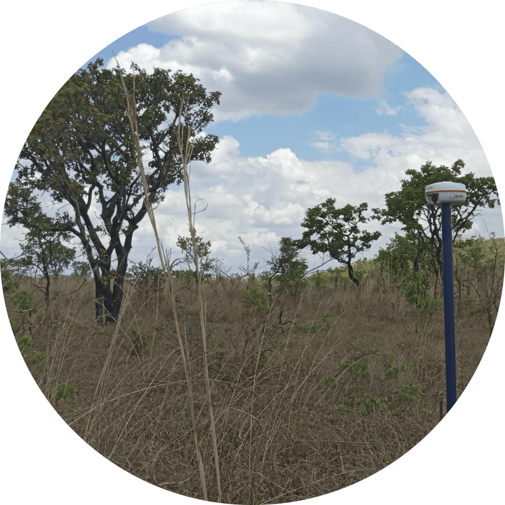
```
<br>

</div>

<div>

<br>

- "Análise morfológica e molecular de espécies do complexo _Piper fuligineum_" coordenado pela professora Msc. Dra. Micheline Carvalho-Silva.
<br>
<br>

- "Decomposição de serrapilheira em Cerrado Rupestre" coordenado pelo professor Msc. Dr. José Roberto Pinto. Este projeto teve coleta de amostras no Parque Estadual dos Pirineus no município de Cocalzinho-GO.
<br>
<br>

- "Estoque de carbono da vegetação lenhosa em área de cerrado após distúrbios" coordenado pela professora Msc. Dra. Alba Valéria Rezende. A área de estudo desse projeto foi a Estação Ecológica de Águas Emendadas.
<br>
<br>

- "A morfologia das sementes de Piperaceae do cerrado" coordenado pela professora Msc. Dra. Micheline Carvalho-Silva.
<br>

</div>
</div>

<div style="display: flex;">
<div>

<br>
Tive a oportunidade de apresentar os resumos dos três últimos projetos em formato de poster no Congresso de Iniciação Científica da UnB - 2022. Os três trabalhos foram indicados à premiação.
<br>
<br>
O trabalho sobre a morfologia de sementes de Piperaceae teve o resumo publicado no Congresso Nacional de Botânica em 2022.
<br>
<br>
A pesquisa sobre decomposição de serrapilheira em Cerrado Rupestre foi parte de um projeto maior que teve como un dos resultados o resumo "Produção anual e sazonal de serapilheira em ambientes de cerrado sentido restrito" publicado nos anais do 9º Congresso Florestal Brasileiro.
<br>

</div>

<div>
<br>
```{r, echo=FALSE, out.width='80%', fig.align='center', message=FALSE, warning=FALSE}
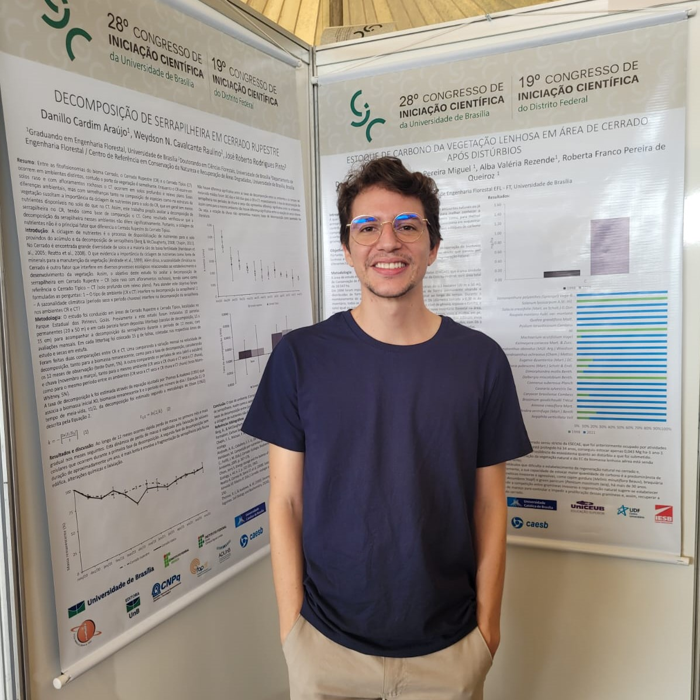
```
<br>
</div>
</div>
```{r, echo=FALSE, out.width='100%', fig.align='center', message=FALSE, warning=FALSE}
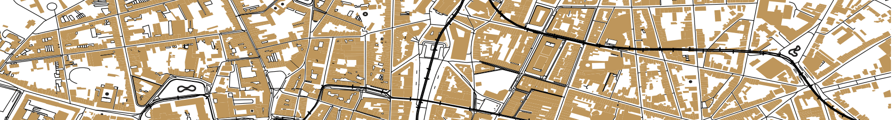
```

# Estágio

Fiz estágio na Terracap (Companhia Imobiliária de Brasília) 20 horas por semana durante dois anos. Trabalhei no Núcleo de Licenciamento que faz parte da Gerência de Meio Ambiente. Na Terracap, tive a oportunidade de fazer parte de uma equipe muito unida, competente e com características multidisciplinares, pois faziam parte agrônomos, engenheiros florestais, biólogos, geólogos, engenheiros de produção e engenheiros ambientais.
<br>
<br>
No estágio, era responsável por produzir mapas de uso do solo e mapas de vegetação para eleborar estudos que vão compor relatórios de compensação florestal. Também fazia parte das minhas atribuições a eleborações de pequenos inventários florestais e análise de inventários contratados pela empresa. A elaboração do inventário envolve desde a parte de planejamento e medição de árvores até a elaboração do relatório.
<br>
<br>
Segue alguns trabalhos elaborados durante meu período de estágio.
<br>
<br>

### Estudo para compensação pretérita e compensação futura.

Para fins de regularização de empreendimentos da Terracap, são requeridas pelo orgão ambiental a compensação pretérita (compensação relativa as supressões de vegetação após 1991) e a compensação futura.
O calculo da compensação pretérita é feito através da análise de ortofotos históricas da área comparando-as com ortofotos atuais. Assim é possível saber a área de vegetação nativa que foi suprimida de 1991 (marco legal para compensação no DF) até o momento do estudo. Um dos produtos desta análise são mapas que auxiliam na visualização destas áreas.

<br>
```{r, echo=FALSE, out.width='75%', fig.align='center', message=FALSE, warning=FALSE}
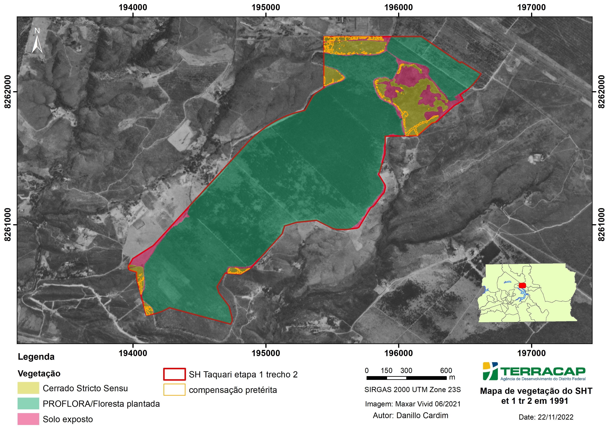
```
<br>
<br>
```{r, echo=FALSE, out.width='75%', fig.align='center', message=FALSE, warning=FALSE}
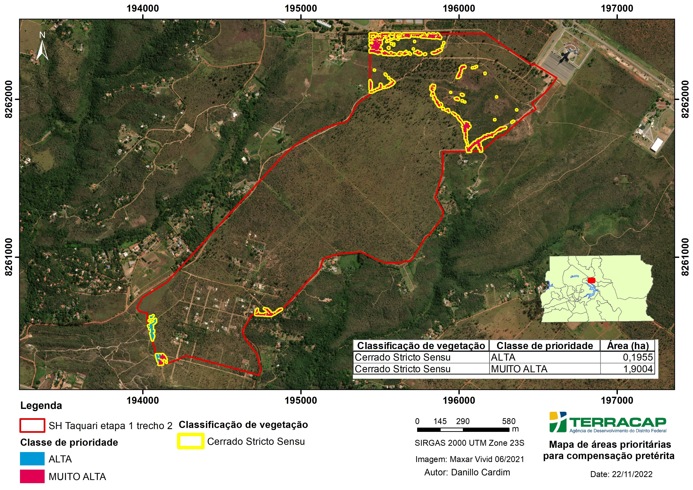
```
<br>

<br>
Na compensação futura são observadas as áreas de vegetação remanescente que serão suprimidas com base na poligonal de supressão. 
O mapa de uso do solo foi classificado através da técnica de classificação supervisionada disponível no _software_ ArcMAP 10.8.

<br>
```{r, echo=FALSE, out.width='75%', fig.align='center', message=FALSE, warning=FALSE}
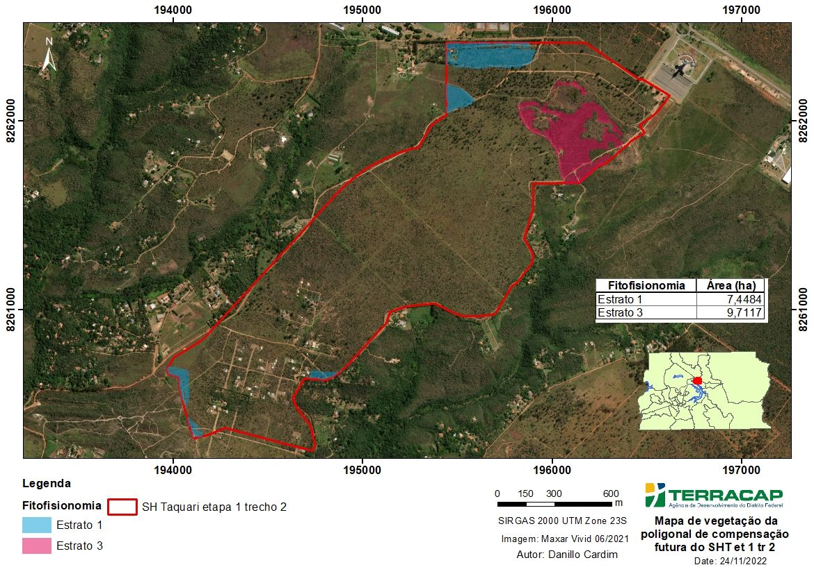
```
<br>

<br>
```{r, echo=FALSE, out.width='75%', fig.align='center', message=FALSE, warning=TRUE}
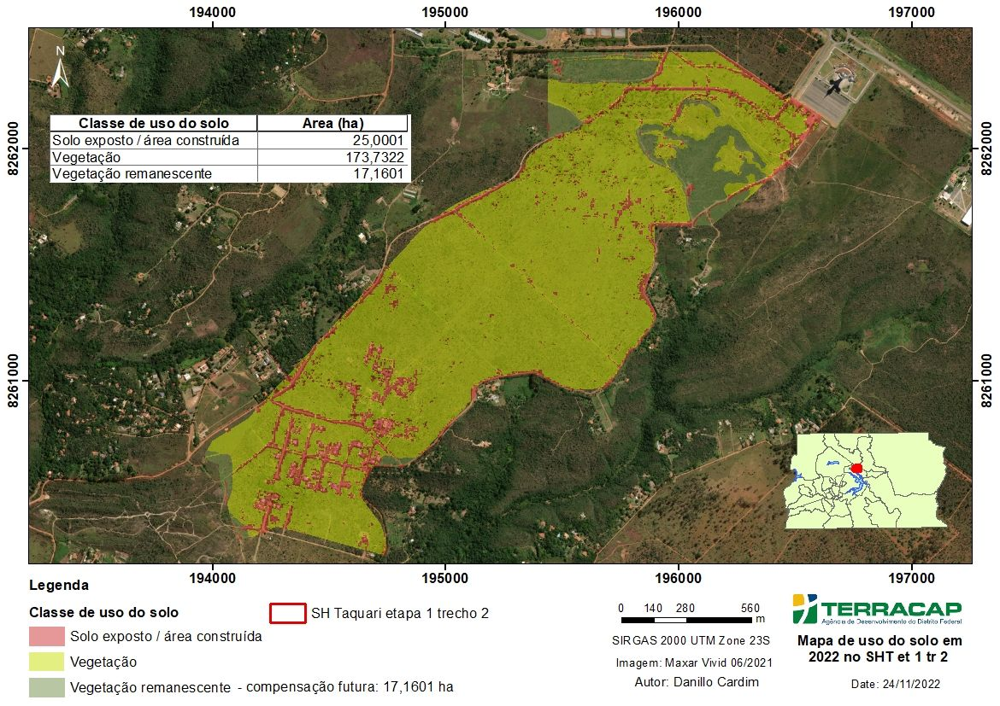
```

<br>

<br>
```{r, echo=FALSE, out.width='75%', fig.align='center', message=FALSE, warning=FALSE}
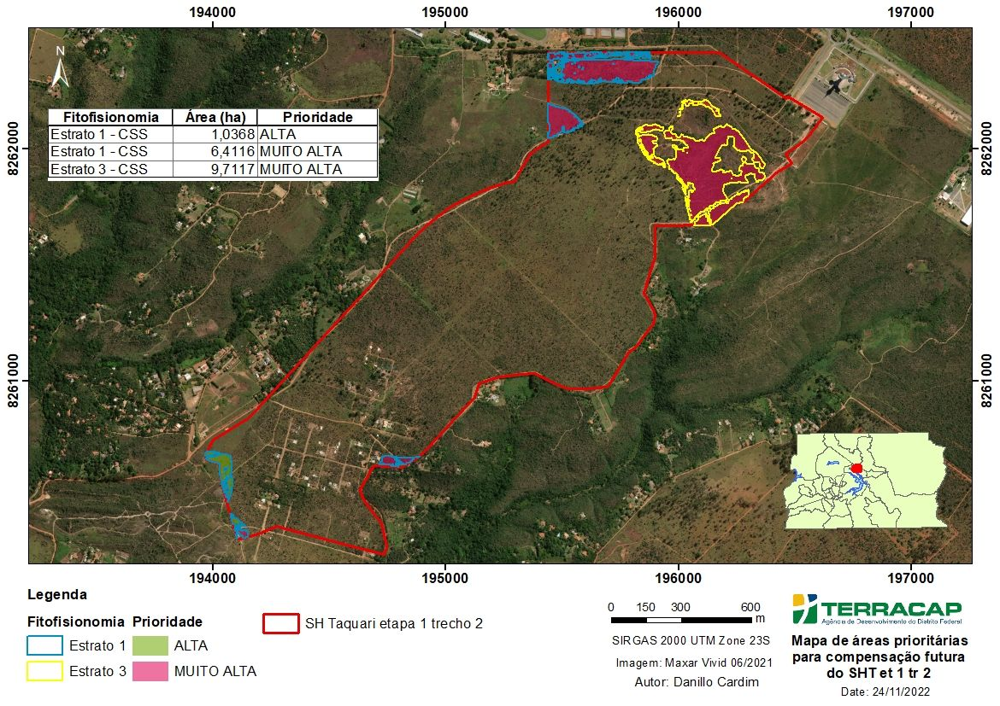
```
<br>

### Inventários florestais
<br>
Para requerimento de Autorização de Supressão Vegetal (ASV) é preciso realizar inventário florestal. Para tanto é necessário elaborar levantamento qualitativo e quantitativo da vegetação presente. Os mapas a seguir foram feitos para a construção de relatórios de inventários.
<br>

```{r, echo=FALSE, out.width='70%', fig.align='center', message=FALSE, fig.cap="Mapa de localização do Projeto Drenar DF"}
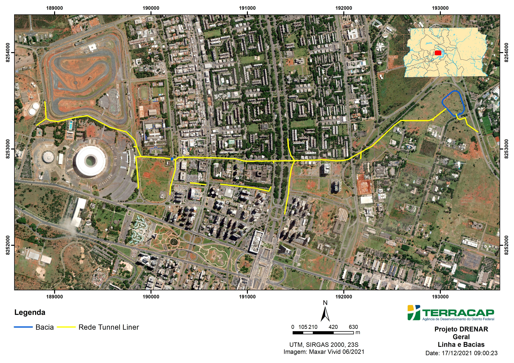
```

```{r, echo=FALSE, out.width='70%', fig.align='center', message=FALSE, fig.cap="Mapa com detalhe da poligonal de supressão do Projeto Drenar DF"}
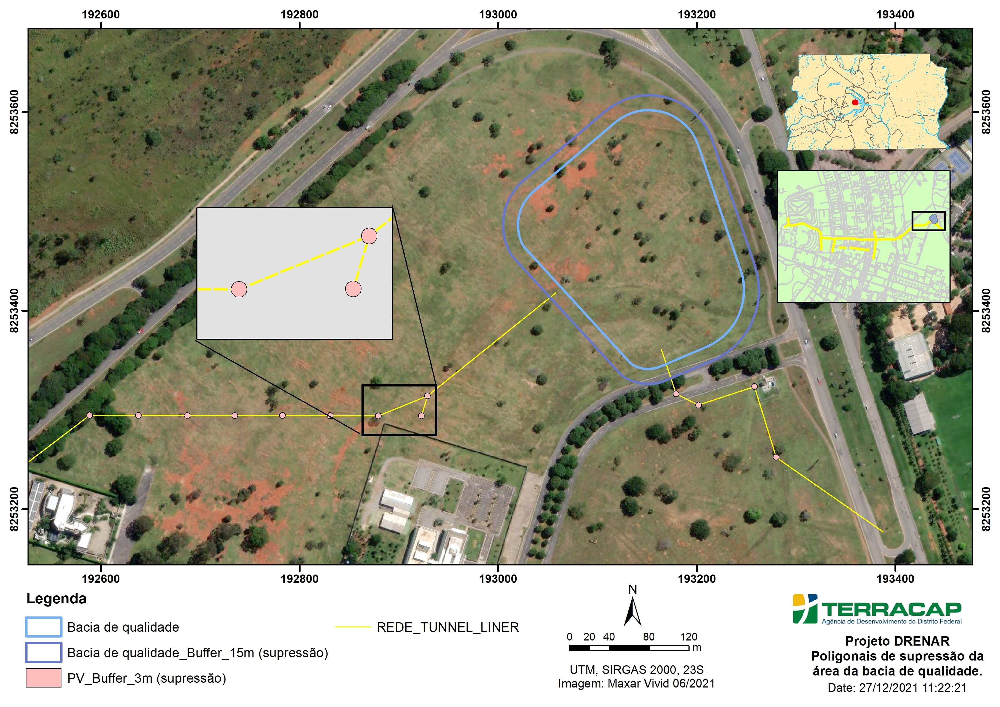
```

```{r, echo=FALSE, out.width='70%', fig.align='center', message=FALSE, fig.cap="Mapa de árvores isoladas na região da bacia do Projeto Drenar DF"}
knitr::include_graphics('./compressed/arviso_drenar.jpg')
```
```{r, echo=FALSE, out.width='100%', fig.align='center', message=FALSE, warning=FALSE}
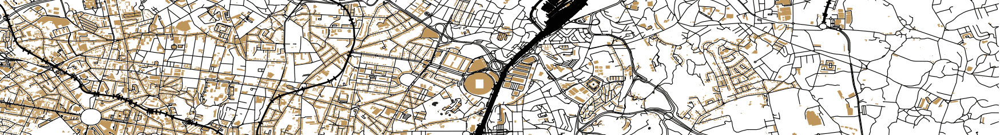
```

# Intercâmbio


<div style="display: flex;">
<div>

<br>
Em 2022 inscrevi-me no programa de mobilidade da UnB. Alguns meses depois saiu o resultado e eu havia sido selecionado para fazer intercâmbio na *Universidade do Porto*. Eu sempre tive o sonho de realizar um intercâmbio durante minha graduação e no último ano consegui realizar. Minha experiência no Porto foi magnífica. Apaixonei-me pela cidade e pela cultura. Foi sem dúvida extraordinário.
<br>
<br>
</div>
<div>
<br>
<br>
```{r, echo=FALSE, out.width='100%', fig.align='center', message=FALSE}
knitr::include_graphics('uportofcup.png')
```
<br>
</div>
</div>

```{r, echo=FALSE, out.width='100%', fig.align='center', message=FALSE}
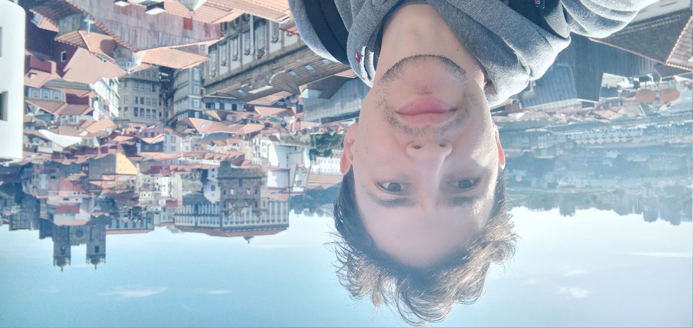
```

```{r, echo=FALSE, out.width='100%', fig.align='center', message=FALSE}
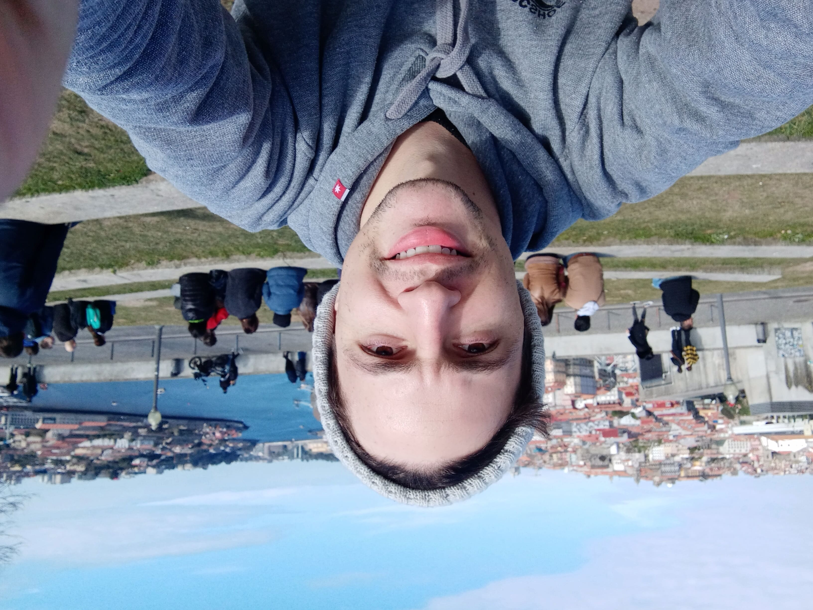
```

```{r, echo=FALSE, out.width='100%', fig.align='center', message=FALSE, warning=FALSE}

```

# Cursos e outras habilidades
<br>
Dentre as muitas áreas que a graduação em engenharia abrange, a **análise de dados** e o **geoprocessamento** são as que mais me chamam atenção. Por conta disso, a maioria dos cursos extracurriculares que fiz foram ligados a essas áreas.
<br>
<br>
Fiz curso para aprender a manusear o **arcmap 10.8**. O curso foi oferecido pela empresa júnior ECOFLOR e teve 20 horas. O conteúdo abordou operações básicas com shapefiles além de classificação de uso do solo com as ferramentas de Classificação Supervisionada e Classificação Não Supervisionada. 
<br>
<br>
Este curso foi o ponto de início para a realização de alguns trabalhos com geoprocessamento, aprender a manusear o QGIS e me ajudou muito no estágio.
<br>

<div style="display: flex;">
<div>
<br>
A **Linguagem R** é muito difundida na comunidade científica para fazer análise de dados. Quando apareceu uma chance de aprender em um curso gratuito também oferecido pela ECOFLOR, aproveitei. O curso abordou pacotes básicos para manipulação de dados e, a exemplo do arcgis, foi o início de uma grande aprendizado. Exemplo disso é a produção deste portifolio feito com RMarkdown e publicado na internet com auxílio da plataforma rpubs.
<br>
<br>
A minha base em programação é C++. Linguagem na qual fui iniciado durante o curso de engenharia. Hoje sou mais familirizado com a Linguagem R, como já citei, e Python. **Python** tem sido meu novo desafio de aprendizado. Tenho feito cursos voltados à análise de dados e machine learning. E meu próximo passo será aprender a linguagem SQL.
<br>
<br>
</div>
<div>
<br>
```{r, echo=FALSE, out.width='50%', fig.align='center', message=FALSE, warning=FALSE}
knitr::include_graphics('D:/Documentos/portfolio/imagens/r_logo.png')
```
<br>
<br>
```{r, echo=FALSE, out.width='150%', fig.align='center', message=FALSE, warning=FALSE}
knitr::include_graphics('D:/Documentos/portfolio/imagens/python.png')
```
<br>
</div>
</div>
<br>
Durante o período em que fui monitor da disciplina _Manejo Florestal_ desenvolvi dois scripts que aplicam a metodologia da mensuração florestal. Um foi construído com o **python** através da interface _jupyter notebook_ e o objetivo foi classificar a capacidade produtiva de um plantio florestal em sítios.
<br>
<br>
```{r, echo=FALSE, out.width='75%', fig.align='center', message=FALSE}
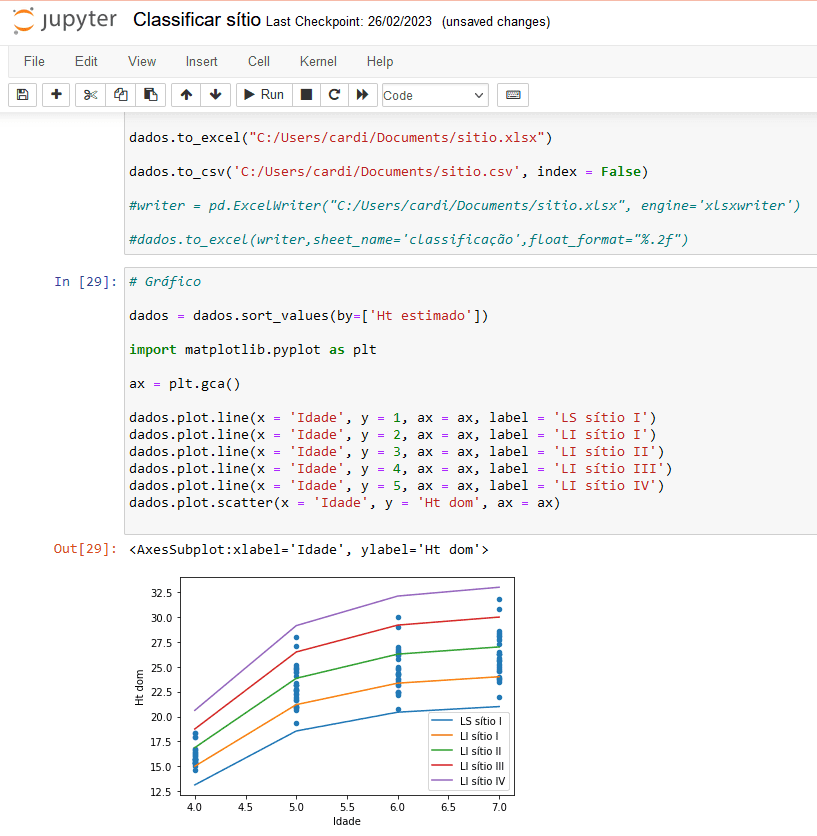
```
<br>
<br>
O outro script foi construído com **liguagem R** e o objetivo foi calcular as alturas dominantes tendo como base os dados oriundos de inventários realizados em anos anteriores. O cálculo das alturas dominantes é importante, pois é uma das variáveis para realizar a prognose de produção de uma maciço florestal.
<br>
<br>
```{r, echo=FALSE, out.width='75%', fig.align='center', message=FALSE}
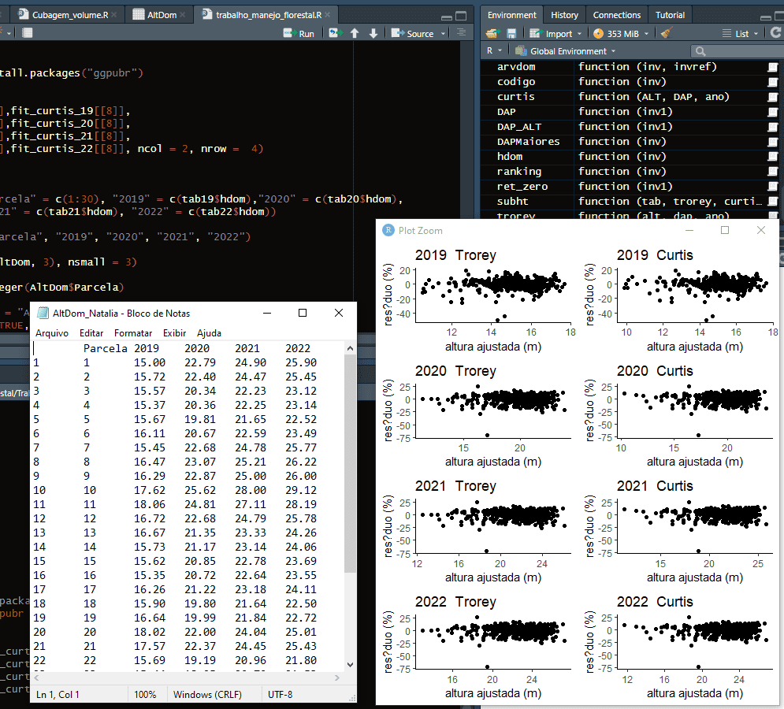
```
<br>

```{r, echo=FALSE, out.width='100%', fig.align='center', message=FALSE, warning=FALSE}

```

# Contatos
<br>

- Telemóvel: 910 434 673
- whatsapp: +55 61 98209 1157 
- email: cardim.danillo@outlook.com
(Como estou no Brasil no momento, ligue-me pelo whatsapp ou mande e-mail)

